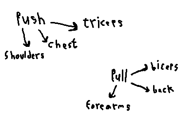

## Bulking
Assuming you are [skinny,](https://archive.org/details/screenshot-2026-08-02-145206) bulking is for you. Bulking is basically having “surplus,” which means getting more calories than your maintenance. “Maintenance,” is the amount of calories you need for your brain, muscles, and other parts of your body to function.

Having surplus alone isn't enough to build muscle tho — it will just add fat. You also need protein, carbs, and consistent training.

## Macro sources
I typically get my protein from protein powder, boiled eggs, and boiled chicken breasts. My carbs mainly come from rice.

# Split
Consider this diagram:  
  
When you push, you usually use these muscles, and when you pull, you usually use those.
