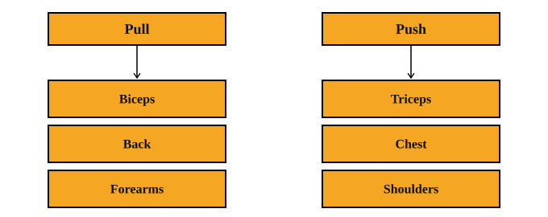

## Bulking
Assuming you are [skinny,](https://archive.org/details/screenshot-2026-08-02-145206) bulking is for you. Bulking is basically having “surplus,” which means getting more calories than your maintenance. “Maintenance,” is the amount of calories you need for your brain, muscles, and other parts of your body to function.

Having surplus alone isn't enough to build muscle tho — it will just add fat. You also need protein, carbs, and consistent training.

## Macro sources
I typically get my protein from protein powder, boiled eggs, and chicken breasts. My carbs mainly come from rice.

## Split
Consider this diagram:  
  
When you pull, you usually use these muscles, and when you push, you usually use those. Having this in mind, here's my split:
| MAIN FOCUS | Exercises |
|------------|-----------|
| PULL: biceps, back, forearms | Vertical row, Pull-down machine (varied attachments), Bicep 21s, Bicep curl |
| PUSH: triceps, chest, shoulders | Chest press, Incline press, [Tricep pushdown (rope)](https://www.youtube.com/watch?v=vB5OHsJ3EME), Seated dip, Shoulder press, Lateral raise |
| LEGS | Leg extension, Incline/decline leg press, [Goblet squat](https://www.youtube.com/watch?v=gCESNsDsbqk), Prone leg curl, Hip abduction/adduction, Calf raise |

## Sleeper build
Something (e.g, vehicle, PC) that looks ordinary or unimpressive on the outside, but has much higher performance [than people expect.](https://www.instagram.com/reels/DZNt7WVpAbJ/)

## Skin care
I use 0.05g of tretinoin, moisturizer whenever my skin peels or feels dry, and sunscreen whenever I go out in the sun. I also shower once or twice a day with cold water and let my hair air-dry.
